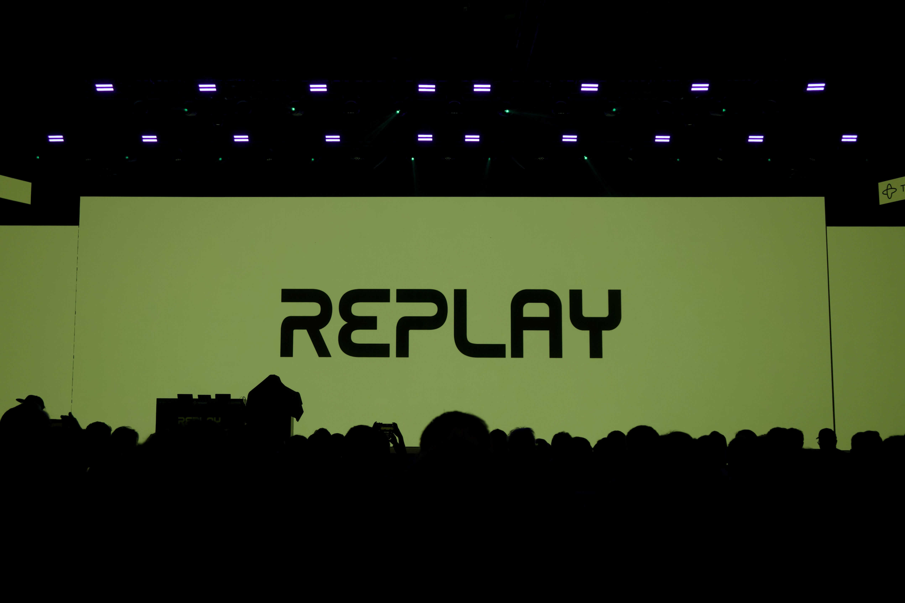

I'm now at my second company using [Temporal](https://temporal.io).

At [Smartrr](https://smartrr.com), Temporal helped us with synchronization
problems between Shopify and our systems that had the usual failure modes of
distributed systems. When I joined [Convergint](https://convergint.com), I
brought that experience with me and started seeing "Temporal-shaped problems"
again. My team has since started using Temporal for our synchronization jobs
while helping our colleagues adopt it as a core primitive of our new engineering
platform.

I recently attended [Temporal Replay 2026](https://replay.temporal.io/) in San
Francisco to learn how far the ecosystem had come and what it looks like to
support Temporal well once more than one or two teams care about it. The
conference was larger than I expected, the talks were hard to choose between,
and the hallway conversations made the Temporal community feel much bigger than
it feels when only interacting online.

I came home convinced that I should push harder for Temporal adoption at
Convergint, and clearer about what that work should look like. We're still
early, so I want us to get better at the parts that make Temporal trustworthy in
practice, support the teams already using it, and defer building more until the
need arises.

## Temporal-shaped problems

Engineers often come to our platform team looking for help matching a problem to
the right technology, preferably something we'll help them operate. Sometimes
they need a database, a public-facing web presence, a way to broadcast events to
other teams, or help with their CI/CD pipeline. Sometimes they have a problem
where retries, partial progress, rollbacks, and complex collaboration are
already part of the work, but nobody has called it "orchestration" yet.

That's the class of problem I mean by "Temporal-shaped." Replay helped me
broaden my sense of that shape. I heard engineers talk about using Temporal for
AI agent loops, self-service infrastructure changes, data pipelines, payments,
and managing long-running execution sandboxes. The details varied, but in each
case, the same themes kept showing up: managing state, gracefully handling
failure, and work that doesn't finish in a single request.

[Shabnam Emdadi](https://replay.temporal.io/speakers/shabnam) of Shopify shared
a clear picture of this in her talk
[_From Normalizing Complexity to Recognizing the Price_](https://www.youtube.com/watch?v=3SS7jZn54BU).
She highlighted how teams often delay orchestration because they think they
don't need it yet, then end up building pieces of it anyway. A retry here, a
status table there, a support runbook off to the side, and eventually the team
owns a small workflow engine they never intended to build.

That's the habit I want us to get better at spotting. When teams are solving
reliability problems with point solutions, we should be able to recognize the
shape early and help them decide whether Temporal belongs in the design.

Temporal employees pointed me toward the official samples repositories for
[TypeScript](https://github.com/temporalio/samples-typescript),
[Go](https://github.com/temporalio/samples-go), and
[Java](https://github.com/temporalio/samples-java), along with the
[Temporal Code Exchange](https://temporal.io/code-exchange) and
[Validated Patterns](https://temporal.io/resources/validated-patterns), as good
places to mine for common patterns. I want us to spend more time with those
examples, including asking AI to explain the patterns back to us, so we're
better prepared to recognize the same shapes in our own work and the work of our
colleagues.

## Ensuring Temporal's "reliable as gravity" promise

Temporal's big promise is that it drastically simplifies running reliable,
scalable, and resilient applications. This works when developers use Temporal's
framework well, but learning to do that takes time. As platform engineers, we
can help developers get there more quickly by educating ourselves in the core
Temporal primitives that drive this reliability.

At first, this means understanding how to decompose work into
[activities](https://docs.temporal.io/activities) and then stitch them back
together with [workflows](https://docs.temporal.io/workflows). Temporal's
[error classes](https://docs.temporal.io/encyclopedia/retry-policies?sdk-language=typescript#non-retryable-errors)
let activities signal when an action should or shouldn't be retried.
[Timeout](https://docs.temporal.io/encyclopedia/detecting-workflow-failures) and
[retry](https://docs.temporal.io/encyclopedia/retry-policies) policies in both
the client and server configuration give developers control over how hanging
actions are detected, how soon to retry, and how many times to retry before
giving up.

As developers live with Temporal for a while, they'll run into additional
concerns that are just as important and less familiar to our team today. When
the code inside a workflow needs to change,
[workflow versioning](https://learn.temporal.io/courses/versioning/),
[worker versioning](https://docs.temporal.io/production-deployment/worker-deployments/worker-versioning),
or both can preserve deterministic execution as the new code path is deployed.
At scale, the newly announced
[task queue priority and fairness](https://docs.temporal.io/develop/task-queue-priority-fairness)
configurations can help allocate resources across a multi-tenant fleet of
workflows. Finally, as we increase the number of teams actively deploying
Temporal workflows, we'll likely want to investigate the
[Temporal Worker Controller](https://github.com/temporalio/temporal-worker-controller)
to understand its capabilities and decide if we'd benefit.

## Just-in-time platform building

I'm a big proponent of incremental value creation. Call it Lean, Agile, whatever
you want, but building just enough of a thing while keeping an eye on the bigger
picture gives us an opportunity for early feedback and unblocks simpler use
cases while retaining the extensibility needed to fulfill the grander vision.

Listening to [Rob Zienert](https://replay.temporal.io/speakers/rob-zienert)'s
talk
[_The Path to Temporal General Availability at Netflix_](https://www.youtube.com/watch?v=0-ChPo8xZqA)
helped me see how that would play out long term as we build out Temporal on our
platform. So many of his early sentiments matched my own experience: patient
support work, careful scope control, and being real with developers about what's
currently supported and what isn't. In his talk, he described the slow journey
from scratching his own itch to
[solve reliability problems in Spinnaker](https://netflixtechblog.com/how-temporal-powers-reliable-cloud-operations-at-netflix-73c69ccb5953),
to offering Temporal to his colleagues on a best-effort basis alongside his
normal Spinnaker work, to finally having enough enterprise integration and
mindshare at Netflix to warrant building a small team around the offering and
admitting it to the Netflix "paved path".

The talk wasn't super technical. It was encouraging to hear about his journey
and how platform work can be slow, methodical, and empathetic.

This reinforces my "just-in-time platform building" conviction. At Convergint,
we're early in our Temporal journey. Temporal is functional and helping teams,
and there are some immediate places we can help teams understand the "Temporal
101" reliability primitives and try out new onboarding features like
[Standalone Activities](https://docs.temporal.io/standalone-activity).

Being early in our journey also means some things can wait, such as support for
exposing Temporal Workflows across namespaces via
[Nexus](https://docs.temporal.io/nexus). As demand for additional Temporal use
cases grows, we'll be there to meet it, but if not, we won't have overbuilt.

## Moving forward with Temporal at Convergint

The key takeaway after leaving Temporal Replay this year is that "Everything is
Fine"™, and we should keep going: learn more about Temporal, teach it to my
colleagues, and advocate harder for its adoption. It's a genuinely powerful tool
that's underused, and we're at the right stage to make it easier for more teams
to reach for it without needing to do a deep platform build-out.
